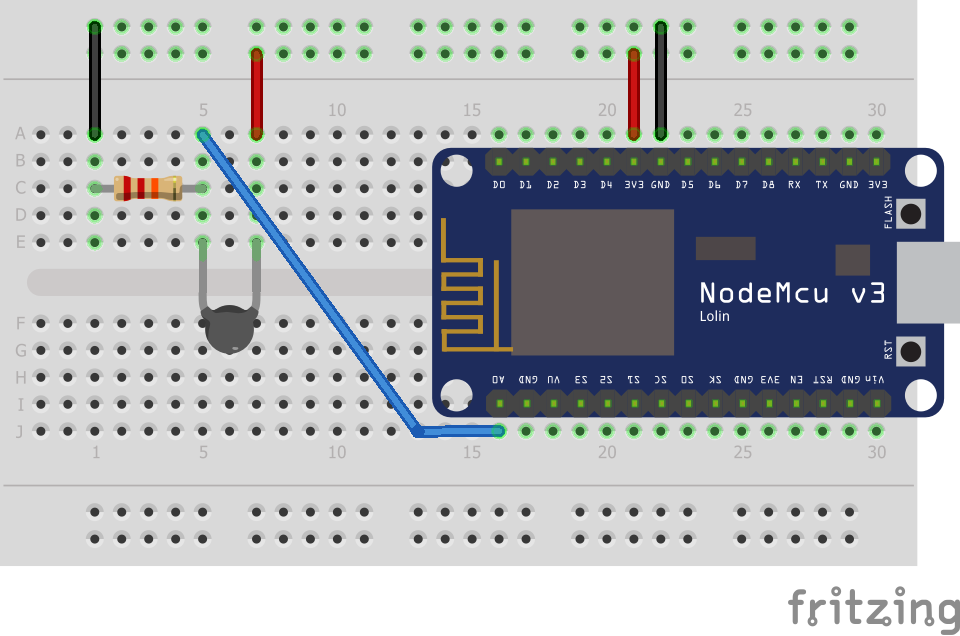

# nodemcu-wireless-thermometer
Wireless cooking thermometer using NodeMCU (ESP12E) and ThermoPro TP17's temperature probes (22kΩ thermistors)

## Wiring


## How it works
Once connected to your network, it will start broadcasting UDP packets on port `13337`. These packets are in JSON format and contain the following fields:
| Field | Type      | Description                                                           |
|-------|-----------|-----------------------------------------------------------------------|
| `ts`  | `integer` | UNIX time (in seconds) at which the temperature reading was performed |
| `t`   | `float`   | Temperature reading in degrees Celsius                                |

Here is an example:
```json
{ "ts": 1635378303, "t": 23.99 }
```

## Usage and customization
If you'd like to use this project with a different temperature probe than mine, follow these steps:
1. Set the base resistance (in ohms) of your thermistor [here](https://github.com/andycodesstuff/nodemcu-wireless-thermometer/blob/main/src/sensors/thermistor.h#L19)
2. Find the **A**, **B** and **C** [Steinhart–Hart equation](https://en.wikipedia.org/wiki/Steinhart%E2%80%93Hart_equation) coefficients
   and set them [here](https://github.com/andycodesstuff/nodemcu-wireless-thermometer/blob/main/src/sensors/thermistor.h#L22).
   To facilitate this process, I used an online calculator such as https://www.thinksrs.com/downloads/programs/therm%20calc/ntccalibrator/ntccalculator.html
3. Under `src/` folder, create an `env.h` file with the following content:
   ```C++
   #ifndef env_h
   #define env_h

   const char *WIFI_SSID = "<YOUR_WIFI_NAME>";
   const char *WIFI_PASSPHRASE = "<YOUR_WIFI_PASSWORD>";

   #endif
   ```
   and substitute `<YOUR_WIFI_NAME>` and `<YOUR_WIFI_PASSWORD>` according to your setup

Note: You may also need to change the analog pin used to fetch temperature data and the resolution of the ADC unit, depending on the hardware you end up using.
      You can change that [here](https://github.com/andycodesstuff/nodemcu-wireless-thermometer/blob/main/src/main.cpp#L14)
